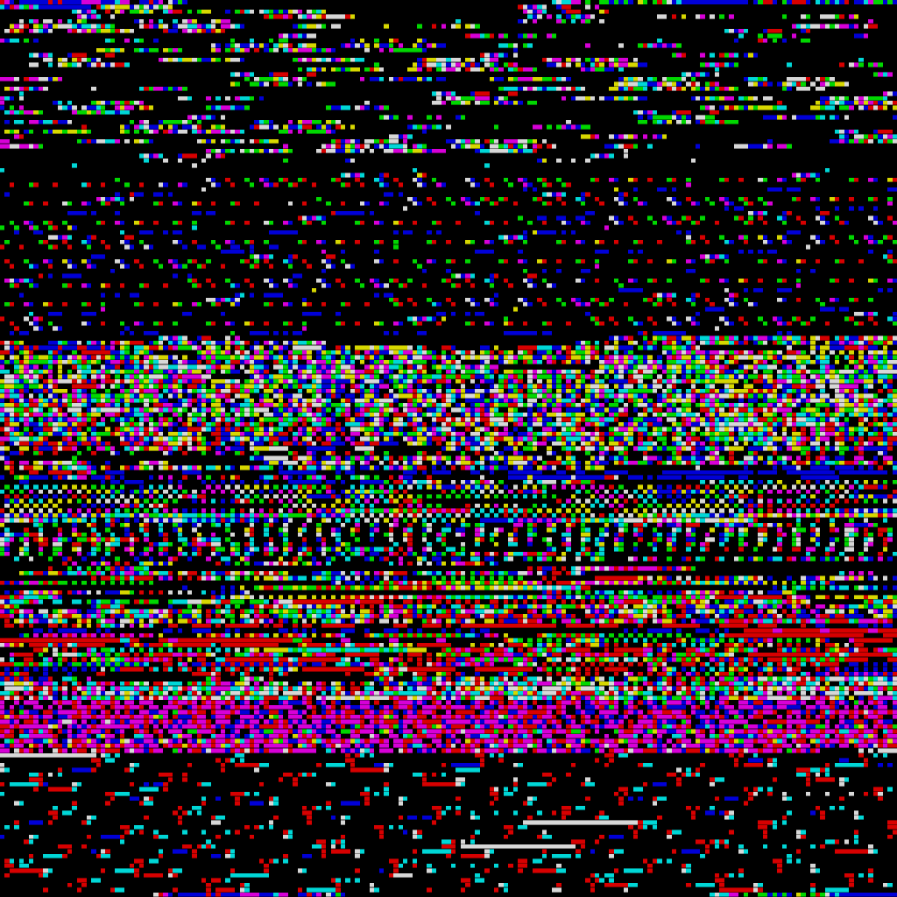
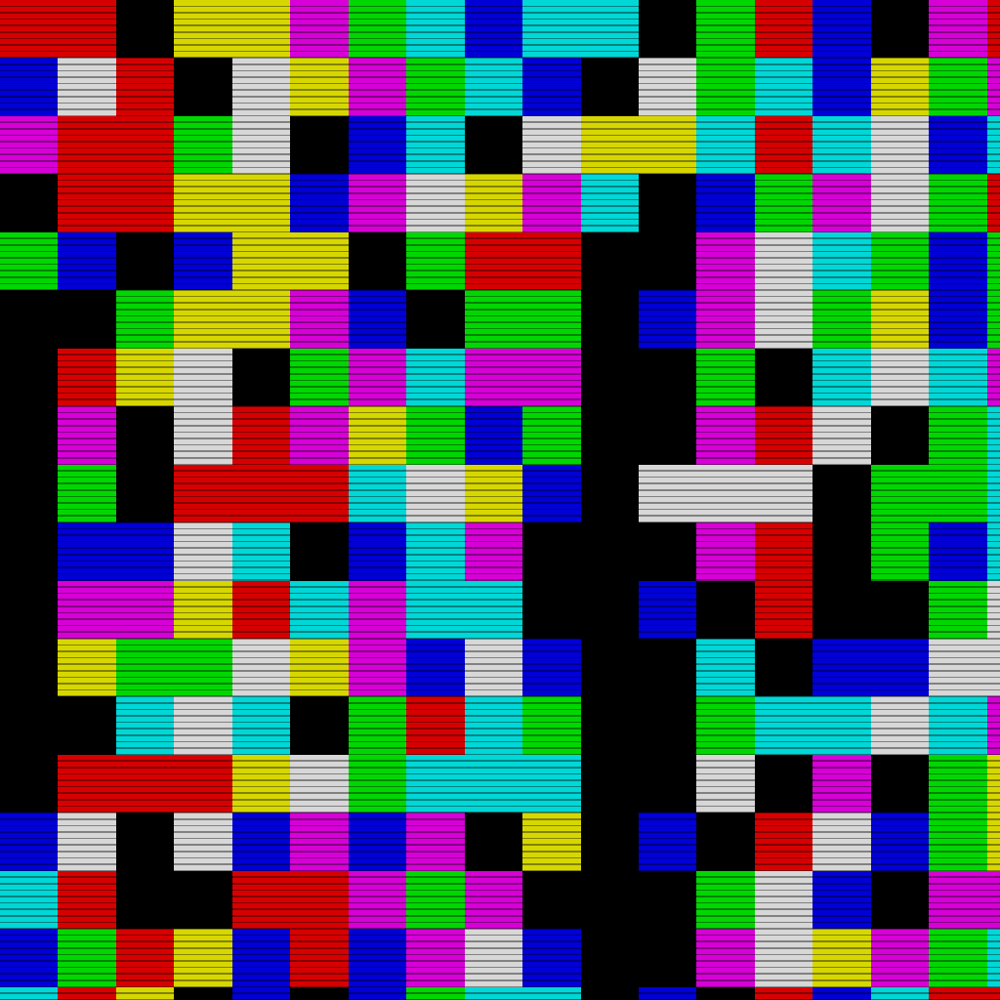
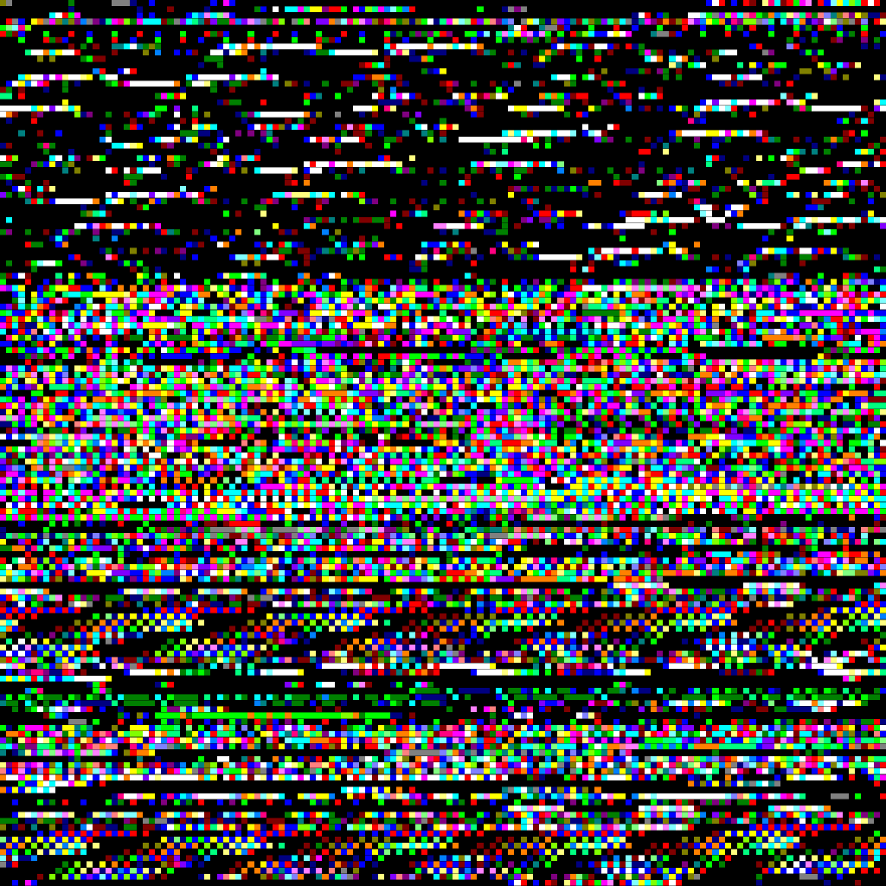
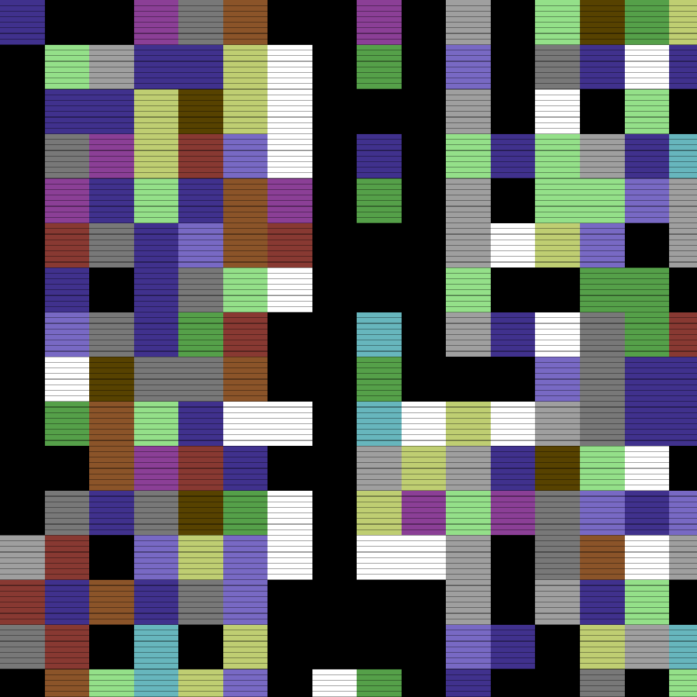
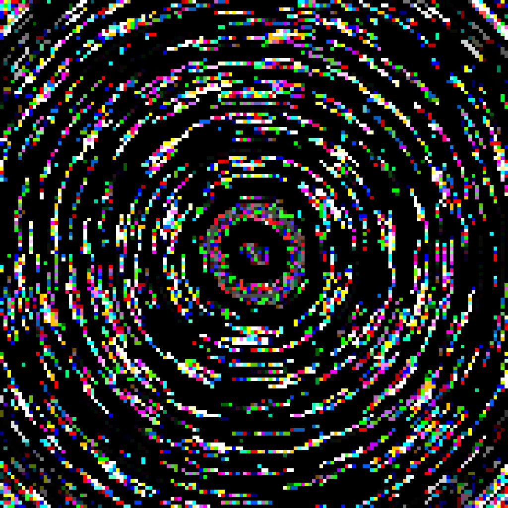
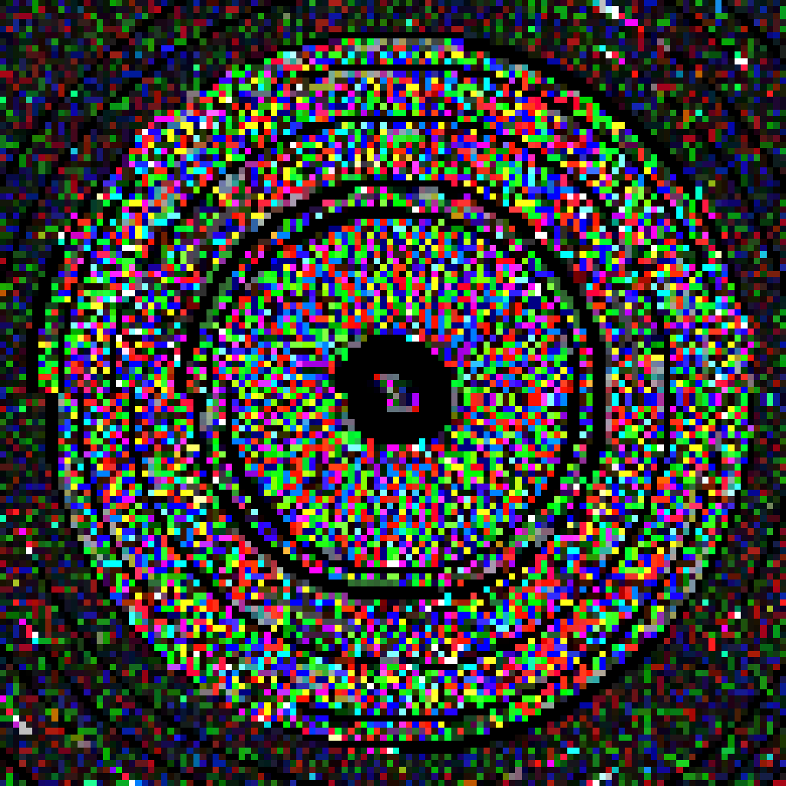

```
 ____  _       ____    _         _
| __ )(_)_ __ |___ \  / \   _ __| |_
|  _ \| | '_ \  __) |/ _ \ | '__| __|
| |_) | | | | |/ __// ___ \| |  | |_
|____/|_|_| |_|_____/_/   \_\_|   \__|
```

Bin2Art transforms binary files into abstract artwork. It reads ROMs, disk images, executables, and other binary data, interpreting the bytes as RGB colour values to create unique visual patterns.


## Examples

| Spectrum + Horizontal | Spectrum + Blocks | CPC + Horizontal |
|:---------------------:|:-----------------:|:----------------:|
|  |  |  |

| C64 + Blocks | Neon + Radial | Neon + Radial |
|:------------:|:-------------:|:-------------:|
|  |  |  |

## Key Features

The tool offers several visualisation options:

- **Colour Modes**: Normal RGB mapping, amplified contrast, neon, plus retro palettes (Game Boy, Amstrad CPC, Commodore 64, ZX Spectrum)
- **Pattern Effects**: Linear, mosaic, Hilbert curve, radial/mandala, horizontal bands, diagonal stripes, chunky blocks
- **Retro Effects**: CRT-style scanlines (`--scanlines`) and pixel art antialiasing (`--antialias`), or both (`--retro`)
- **Post-Processing**: Blur, colour enhancement, contrast boost, posterisation, or all at once (`--all-effects`)
- **Output Options**: Configurable size (default 1024px), format (PNG/JPEG/BMP), and output directory

## Installation

```bash
git clone https://github.com/DarrenBenson/Bin2Art.git
cd Bin2Art

# Optional: create virtual environment
python -m venv venv
source venv/bin/activate  # Windows: venv\Scripts\activate

pip install -r requirements.txt
```

Requires Python 3.8+ and pip.

## Usage

Place supported files in the directory and run:

```bash
# Process all supported files with defaults
python bin2art.py

# Apply colour mode and effect
python bin2art.py --color spectrum --effect horizontal

# Add retro CRT effects
python bin2art.py --color spectrum --effect blocks --retro

# Combine multiple options
python bin2art.py --color c64 --effect blocks --scanlines --posterize

# Custom output settings
python bin2art.py --format JPEG --size 3840 --output-dir ./output
```

Supported formats: `.dsk`, `.tap`, `.a26`, `.cdt`, `.rom`, `.mp3`

Output defaults to 1024x1024 PNG with NEAREST resampling for crisp pixels.

## Running Tests

```bash
python run_tests.py
```

## Support & Structure

Run `python bin2art.py --help` for full command reference.

The project uses MIT licensing and welcomes community contributions. See [CONTRIBUTING.md](CONTRIBUTING.md) for guidelines.
